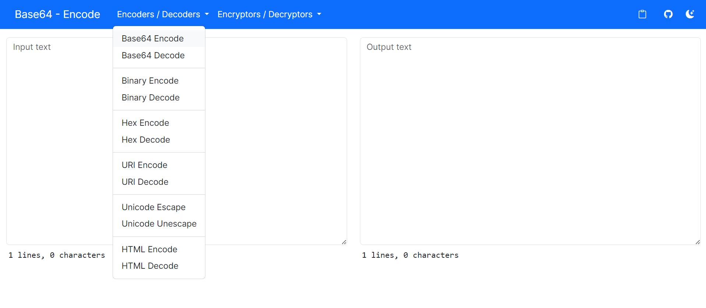

# Text Tools

[Text Tools](https://kaungkhantjc.github.io/text-tools) is a collection of JavaScript (browser) based text processing tools.

Local

## How to use

Visit
<https://kaungkhantjc.github.io/text-tools>.

## Screenshots

## Features

| Tool  | Mode |
| ------------- | ------------- |
|  Base64  | Encode, Decode  |
|  Binary  | Encode, Decode  |
|  Hex  | Encode, Decode  |
|  URI  | Encode, Decode  |
|  Unicode String  | Escape, Unescape  |
|  HTML  | Encode, Decode  |
|  Base64 Xor  | Encrypt, Decrypt  |
|  AES256  | Encrypt, Decrypt  |

### Contributing

We'd love to accept your patches and contributions to this project. All submissions, including submissions by project members, require review. We
use GitHub pull requests for this purpose. Consult
[GitHub Help](https://help.github.com/articles/about-pull-requests/) for more
information on using pull requests.

Please perform a quick search to check if there are already existing issues or pull requests related to your contribution.

## License

Text Tools is released under the [Apache 2.0 license](LICENSE).

    Copyright 2024 Text Tools Contributors

    Licensed under the Apache License, Version 2.0 (the "License");
    you may not use this file except in compliance with the License.
    You may obtain a copy of the License at

        http://www.apache.org/licenses/LICENSE-2.0

    Unless required by applicable law or agreed to in writing, software
    distributed under the License is distributed on an "AS IS" BASIS,
    WITHOUT WARRANTIES OR CONDITIONS OF ANY KIND, either express or implied.
    See the License for the specific language governing permissions and
    limitations under the License.
